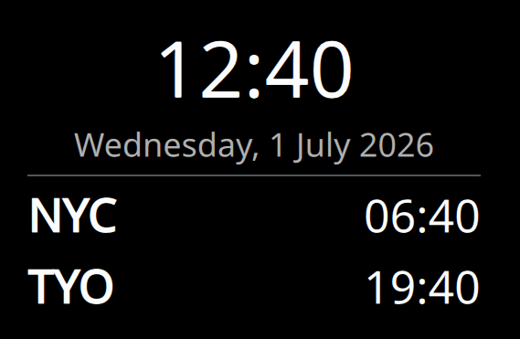

# World Clock — a multi-timezone clock for KDE Plasma 6

A Plasma 6 desktop widget (plasmoid) that shows the current time and date for
several time zones at once, one row per zone.



## Features

- One row per time zone: city name, time, and (optionally) date and UTC offset.
- Add, remove, and reorder zones from the widget's settings.
- 12-hour or 24-hour clock.
- Toggle seconds (the widget ticks once per second only when enabled).
- Toggle the date line and the UTC-offset line.
- Uses Plasma's `time` data engine for correct, DST-aware zone conversion.

## Requirements

- KDE Plasma 6 (Qt 6, KDE Frameworks 6).
- `kpackagetool6` (ships with Plasma) for installation.

## Install

```sh
./install.sh
```

Then right-click the desktop or a panel → **Add Widgets…** → search for
**World Clock**, and drag it into place.

To update after editing the sources, run `./install.sh` again; if the widget is
already on screen, restart the shell to reload it:

```sh
kquitapp6 plasmashell && kstart plasmashell
```

## Uninstall

```sh
./uninstall.sh
```

## Configuration

Right-click the widget → **Configure World Clock…**:

- **Appearance** — 24-hour format, seconds, date line, UTC-offset line.
- **Time Zones** — add a zone from the picker, and use the up/down/remove
  buttons to order the list. The first zone is also what the compact
  (panel) view shows.

## Project layout

```
package/
  metadata.json                 Plasmoid metadata (id, name, icon, category)
  contents/
    config/
      main.xml                  KConfigXT settings schema
      config.qml                Registers the two settings pages
    ui/
      main.qml                  Widget: compact + full representation
      configGeneral.qml         "Appearance" settings page
      configTimezones.qml       "Time Zones" add/remove/reorder page
      timezones.js              Curated IANA zone list for the picker
```

## License

GPL-3.0-or-later.
